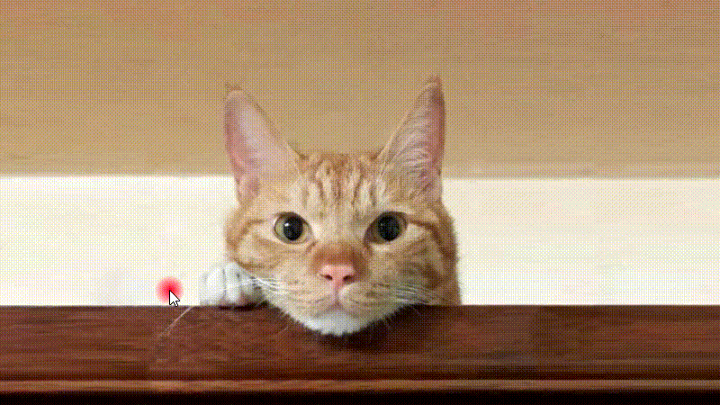

## depthmap 과 shader을 사용한 인터렉티브 이벤트 

2d 이미지를 depth맵을 통해 3d처럼 느껴지는 효과<br>
Threejs + Shader + webpack

## Folder Structure

After creation, your project should look like this:

```
my-app/
  README.md
  node_modules/
  package.json
  img/
    gold.jpg
    map_gold.jpg
  src/
    script.js
  webpack.config.js
```

## Development

Nodejs 및 Npm 설치 후,
```
# Install Packages
npm install
# Build
npm run build
# Run Dev
npm start
    
```
## Screenshot

